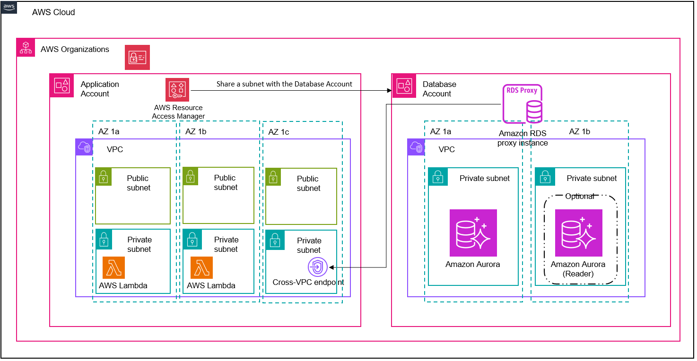

<!---
Copyright Amazon.com, Inc. or its affiliates. All Rights Reserved.
SPDX-License-Identifier: MIT-0
--->

# Cross Account IAM Authentication using RDS Proxy

This CDK project creates infrastructure to demonstrate how to setup a cross-account connection between a Lambda function and an RDS cluster using RDS proxy endpoints and IAM DB authentication.

## Architecture Diagram



## Prerequisites

Before getting started, make sure to complete the following prerequisites:

- Create an organization with all features enabled. With all features enabled, you can share resources at the organization, organizational unit, and account level, and use the advanced account management features available in Organizations such as integration with supported AWS services and organization management policies.
- Enable resource sharing within Organizations.
- Create at least two accounts in the Organization. One will serve as the `DatabaseAccount` where the PostgreSQL RDS database will be hosted, and the other the `ApplicationAccount` where the compute infrastructure to access the database will be hosted.
- Make sure you have access to an IAM role in the `ApplicationAccount` and `DatabaseAccount` with administrative permissions to deploy all the infrastructure included in this project.
- Make sure you have the following tooling installed locally:
  - `cdk`
  - `aws cli`
  - `Python` (v3.9 or higher)
  - `pip`
  - `make`
- This project requires Linux/MacOS; Windows is currently not supported.

## Third-Party tooling

[Psycopg2](https://pypi.org/project/psycopg2/) is a modern implementation of a PostgreSQL adapter for Python. Psycopg2 is released under the terms of the GNU Lesser General Public License, allowing use from both free and proprietary software. In this project, `psycgop2` will be installed locally as an archive to be uploaded as a code dependency for Lambda to make a database connect to PostgreSQL for purely demonstrative purposes.

## Deployment Instructions

1. Clone the GitHub repository using HTTPS or SSH, and change into the top-level directory for the project. URL for SSH shown below:

```
git clone git@github.com:aws-samples/cross-account-iam-auth-with-rds-proxy.git
cd cross-account-iam-auth-with-rds-proxy
```

2. Run `python --version` to discover the version of Python that you are running. This project at least requires Python 3.9.

```
python --version
```

3. Modify `cdk.json` with the following context variable based on your Python version:

| Parameter Name | Description                                                                                                                                       | Suggested Default |
| -------------- | ------------------------------------------------------------------------------------------------------------------------------------------------- | ----------------- |
| python_version | The local Python version that you'll use to create the `psycopg2` layer. Must be at least `3.9`, which is the version this project was tested on. | 3.9               |

4. Run `make setup` to create the `psycopg2` layer artifact in `assets/layers/psycopg2`:

```
make setup
```

5. Create a Python virtualenv:

```
python3 -m venv .venv
```

6. Activate the virtualenv:

```
source .venv/bin/activate
```

7. Install Python requirements:

```
pip install -r requirements.txt
```

8. Run `aws configure` to setup a profile for the application account and database account. You will need to generate programmatic access keys for your IAM role in each account and add them here:

```
aws configure --profile application-account
aws configure --profile database-account
```

9. If this is the first time that you're running CDK in your accounts, you'll need to run `cdk bootstrap`. More information on this can be found [here](https://docs.aws.amazon.com/cdk/v2/guide/bootstrapping.html):

```
cdk bootstrap --profile application-account
cdk bootstrap --profile database-account
```

10. Modify `cdk.json` with the following context variable:

| Parameter Name         | Description                                                                       | Suggested Default |
| ---------------------- | --------------------------------------------------------------------------------- | ----------------- |
| database_account_id    | The account id of the account where you intend to deploy the RDS database         | N/A               |
| application_account_id | The account id of the account where you intend the ConnectionTest Lambda function | N/A               |

11. Deploy to application account. This should take around 7 minutes to complete:

```
cdk deploy ApplicationStack --profile application-account
```

12. Update `cdk.json` with the following outputs from the `ApplicationStack`. These dependencies are used by the `DatabaseStack`.

```
aws cloudformation --region <your-region> describe-stacks --stack-name ApplicationStack --profile application-account --query "Stacks[0].Outputs"
```

| Parameter Name          | Description                                                                                                                | Suggested Default |
| ----------------------- | -------------------------------------------------------------------------------------------------------------------------- | ----------------- |
| application_vpc_id      | The ID of the VPC in the Application account                                                                               | N/A               |
| application_vpc_subnets | The IDs of the subnets in the Application account. Must be listed in comma-delimited format (e.g. 'subnet-xxx,subnet-yyy') | N/A               |

13. Deploy to the database account. Note - this may take around 18 minutes to deploy.:

```
cdk deploy DatabaseStack --profile database-account
```

14. Run the following command to retrieve the two RDS proxy endpoints created for your database cluster. RDS Proxy lets you create additional endpoints with either a read-only or read/write role. An endpoint with a read-only role routes your queries to Aurora Replicas, while an endpoint with a read/write role routes your queries to the writer instance.

```
aws cloudformation --region <your-region> describe-stacks --stack-name DatabaseStack --profile database-account --query "Stacks[0].Outputs"
```

For this demonstration, copy the CloudFormation output with the key: `ApplicationProxyEndpointOutputreadonly` and copy it into `cdk.json` for the parameter below:

| Parameter Name                 | Description                                                                                                                            | Suggested Default |
| ------------------------------ | -------------------------------------------------------------------------------------------------------------------------------------- | ----------------- |
| application_rds_proxy_endpoint | The RDS proxy endpoint in the Application account. This resource is available after running `cdk deploy` against the Database account. | N/A               |

15. Deploy to the `ApplicationStack` once more. This will update the `connectiontest-lambda` function with the RDS proxy endpoint created in the `DatabaseStack`. This should take about 2 minutes to run:

```
cdk deploy ApplicationStack --profile application-account
```

16. Now that your infrastructure is completely deployed, test invoking the `connectiontest-lambda` function using the below:

```
aws lambda invoke --function-name connectiontest-lambda --cli-binary-format raw-in-base64-out response.json --profile application-account
```

Expected Output:

```
{
    "StatusCode": 200,
    "ExecutedVersion": "$LATEST"
}
```

17. This will create a file called `response.json` in you working directory. Open the file using the command below to view the output:

```
cat response.json
```

Expected Output:

```
{"statusCode": 200, "headers": {"Content-Type": "application/json"}, "body": "Database connection was successful!"}
```

## Cleanup Instructions

1. Destroy the DatabaseStack:

```
cdk destroy DatabaseStack --profile database-account
```

2. Empty the contents of the Lambda Layer bucket so that it can be deleted. This bucket is suffixed with the account ID of the application account:

```
aws s3 rm s3://connectiontest-lambda-layer-bucket-<application-account-id> --recursive --profile application-account
```

3. Destroy the ApplicationStack:

```
cdk destroy ApplicationStack --profile application-account
```


## Security

See [CONTRIBUTING](CONTRIBUTING.md#security-issue-notifications) for more information.

## License

This library is licensed under the MIT-0 License. See the LICENSE file.

